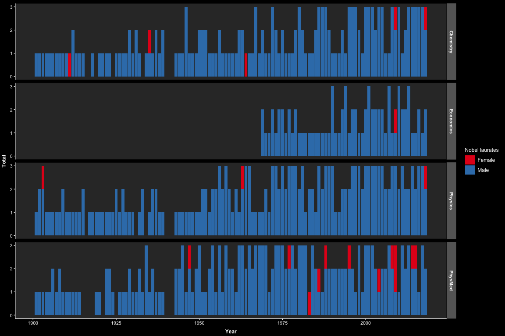
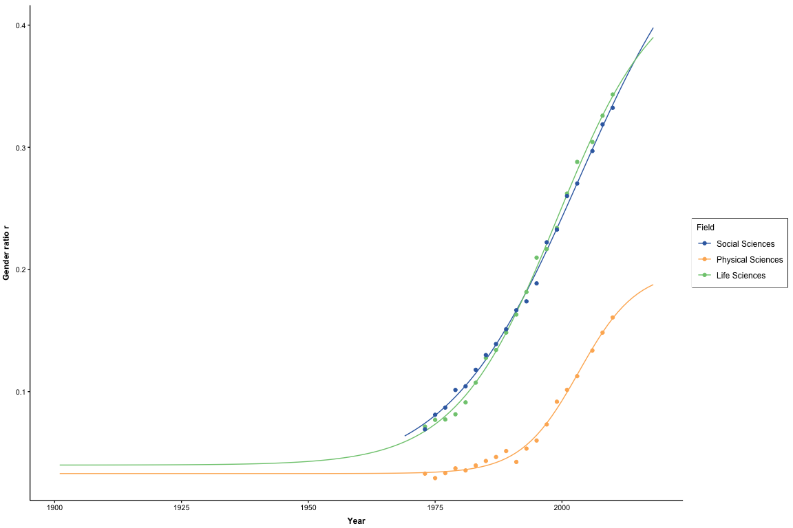
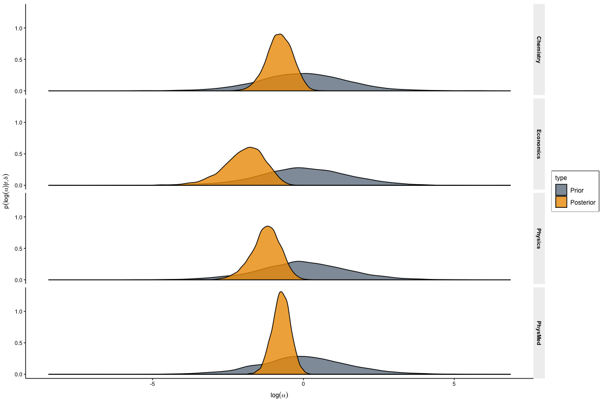
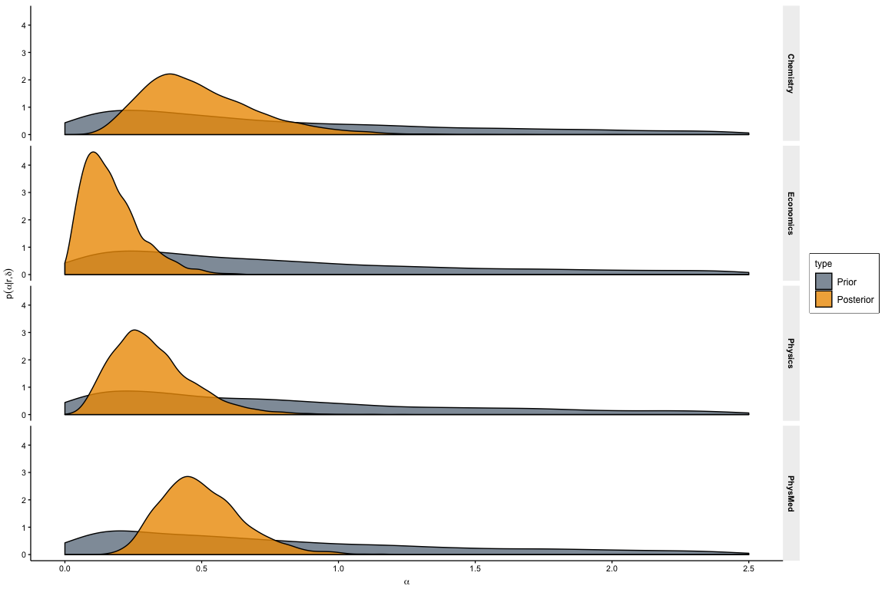

Nobel gender bias
================
Per Lunnemann
31/01/2019

This document is intended as supporting material for the paper "Gender Bias in Nobel Prizes" <https://arxiv.org/abs/1810.07280>, with the entire code base for the calculation.

Loading of gender ratio data
============================

We load the data from The National Research Foundation that describes the US faculty members gender ratio within various scientific fields. The grouping is slightly different from the categories of Nobel prizes, so we do a little renaming and regrouping. Notably, we assume that "Social sciences" can be exchanged with the subset "Economics" and "Life Science" is exchanged for "Physiology or Medicin".

``` r
allDF <- read.csv('genderDistribution.csv')

ratioDF <- allDF %>% 
  gather(key='subject', value = 'value', -Year,-gender,-position) %>% 
  spread(key = gender, value = value)

# relabel
ratioDF <- ratioDF %>% mutate(prize = case_when(subject == 'Physical.sciences' ~ 'Physics', 
                                                subject == "Social.sciences" ~  'Economics', 
                                                subject == "Life.sciences" ~  'PhysMed', 
                                                TRUE ~ as.character(NA)
                                                )) %>%
                                mutate(ratio = female/both)

# copy physics into chemistry assuming ratio in chemistry is the same
chemDF <- ratioDF %>% filter(prize == 'Physics') %>% mutate(prize='Chemistry')

ratioDF <- full_join(ratioDF, chemDF)

gg <- ratioDF %>% 
  ggplot(aes(x=Year, y = ratio, color = position))+
  geom_point()+geom_line()+
  facet_wrap(subject~., scales='free_y')+
  theme_Publication(darkTheme = darkTheme)+
  scale_colour_Publication()

if(saveFigs){
  myggsaver(gg, 'genderRatios.pdf', width = 7, height = 4)
}
gg
```


Load Nobel prize statistics
===========================

First we load the number of laurates within each field for each year seperated into gender

``` r
nobelW <- read.csv('femaleNobelsL.csv')
head(nobelW)
```

    ##   Year Physics_all Physics_female Chemistry_all Chemistry_female econ_all
    ## 1 1901          NA              0            NA                0       NA
    ## 2 1902          NA              0            NA                0       NA
    ## 3 1903          NA              1            NA                0       NA
    ## 4 1904          NA              0            NA                0       NA
    ## 5 1905          NA              0            NA                0       NA
    ## 6 1906          NA              0            NA                0       NA
    ##   Economics_female Physiology.or.Medicine_all
    ## 1                0                         NA
    ## 2                0                         NA
    ## 3                0                         NA
    ## 4                0                         NA
    ## 5                0                         NA
    ## 6                0                         NA
    ##   Physiology.or.Medicine_female
    ## 1                             0
    ## 2                             0
    ## 3                             0
    ## 4                             0
    ## 5                             0
    ## 6                             0

``` r
# put in a long format
nobelW <- nobelW %>% gather(key=subject, value=value, -Year) %>%  
  separate(col = c('subject'), into = c('prize','gender'), sep='_') %>% 
  filter(gender!='all') %>% 
  select(-gender)
```

Next we extract the total number of Nobel laurates as taken from <https://www.nobelprize.org> :

``` r
nobelDF <- read.csv(file = 'nobelLaurates.csv', encoding = 'Latin-1', stringsAsFactors = F)
head(nobelDF)
```

    ##   Year                                      Physics
    ## 1 1901                             Wilhelm R??ntgen
    ## 2 1902              Hendrik Lorentz;\nPieter Zeeman
    ## 3 1903 Henri Becquerel;\nPierre Curie;\nMarie Curie
    ## 4 1904                                Lord Rayleigh
    ## 5 1905                               Philipp Lenard
    ## 6 1906                                J. J. Thomson
    ##                      Chemistry                  Physiology.or.Medicine
    ## 1 Jacobus Henricus van 't Hoff                  Emil Adolf von Behring
    ## 2         Hermann Emil Fischer                             Ronald Ross
    ## 3             Svante Arrhenius                     Niels Ryberg Finsen
    ## 4               William Ramsay                             Ivan Pavlov
    ## 5             Adolf von Baeyer                             Robert Koch
    ## 6                Henri Moissan Camillo Golgi;\nSantiago Ram??n y Cajal
    ##                             Literature
    ## 1                      Sully Prudhomme
    ## 2                      Theodor Mommsen
    ## 3              Bj??rnstjerne Bj??rnson
    ## 4 Fr??d??ric Mistral;\nJos?? Echegaray
    ## 5                   Henryk Sienkiewicz
    ## 6                     Giosu?? Carducci
    ##                                   Peace Economics
    ## 1       Henry Dunant;\nFr??d??ric Passy       ???
    ## 2 ??lie Ducommun;\nCharles Albert Gobat       ???
    ## 3                         Randal Cremer       ???
    ## 4       Institut de Droit International       ???
    ## 5                    Bertha von Suttner       ???
    ## 6                    Theodore Roosevelt       ???

We notice that multiple names are separated by a `;`, and use that to count how many Nobel prizes were given per year per field.

``` r
nobelDF <- nobelDF %>% 
  rowwise() %>% 
  mutate_at( vars(-Year), 
             .funs = function(x) if_else(x == '???' | tolower(x) == 'none',
                                         0L, 
                                         length(strsplit(x, split=';')[[1]])) )  %>% 
  ungroup() %>% 
  as.data.frame() %>% 
  gather(key=prize, value = nbl, -Year)
head(nobelDF)
```

    ##   Year   prize nbl
    ## 1 1901 Physics   1
    ## 2 1902 Physics   2
    ## 3 1903 Physics   3
    ## 4 1904 Physics   1
    ## 5 1905 Physics   1
    ## 6 1906 Physics   1

Now combine that with the number of female laureates:

``` r
allNobelDF <- right_join(nobelDF,nobelW) %>% 
  rename(nbl_f=value) %>% 
  mutate(prize = if_else(prize=="Physiology.or.Medicine" ,'PhysMed', prize))

gg <- allNobelDF %>% mutate(nbl_m=nbl-nbl_f) %>% gather(key=key, value=value,nbl_m, nbl_f) %>% 
  ggplot(aes(x=Year, y=value, fill=key))+
  geom_bar(stat="identity")+
  facet_grid(prize~. , scales='free_y')+ ylab('Total')+
  scale_fill_brewer(palette = "Set1",name = 'Nobel laurates', labels=c("Female","Male"))+
  theme_Publication(darkTheme = TRUE)

if(saveFigs){
  myggsaver(gg = gg, filename = 'nobelLaurateBarPlot.pdf')
}
gg
```



So we can now join the data containing information on the gender ratio (`ratioDF`) and data counting the nobel laureates.

``` r
totDF <- right_join(allNobelDF,ratioDF, by=c('Year','prize'))
sample_n(totDF,10)
```

    ##     Year     prize nbl nbl_f position           subject both female
    ## 79  1979      <NA>  NA    NA   senior       Engineering 11.6    0.1
    ## 307 2001      <NA>  NA    NA   junior        Psychology  6.6    3.9
    ## 190 1991      <NA>  NA    NA      all Computer.sciences  2.0    0.4
    ## 432 1999 Chemistry   1     0      all Physical.sciences 38.7    5.3
    ## 313 2001   Physics   3     0   senior Physical.sciences 20.7    2.1
    ## 369 2008   Physics   3     0   junior Physical.sciences  6.9    1.9
    ## 292 1999   Physics   2     0   senior Physical.sciences 20.7    1.9
    ## 204 1991      <NA>  NA    NA   senior Computer.sciences  0.9    0.1
    ## 344 2006      <NA>  NA    NA   junior Computer.sciences  1.7    0.4
    ## 419 1989 Chemistry   2     0   senior Physical.sciences 21.4    1.1
    ##          ratio
    ## 79  0.00862069
    ## 307 0.59090909
    ## 190 0.20000000
    ## 432 0.13695090
    ## 313 0.10144928
    ## 369 0.27536232
    ## 292 0.09178744
    ## 204 0.11111111
    ## 344 0.23529412
    ## 419 0.05140187

We notice that most values of `nbl` and `nbl_f` are `NA` since we only have gender ratio data back untill year 1973. To accomodate for this we shall do some extrapolation back in time.

Extrapolation
=============

We shall extraplotate assuming a logistic function for each scientific field of the for
$$
f(y) = \\frac{A}{1+\\exp\[(y-y\_0)/g\]}
$$
 where *y* is year and *y*<sub>0</sub> is a fit parameter such that *f*(*y*<sub>0</sub>)=*A*/2. Finally, *g* is a fit variable that determines the characteristic growth time.

``` r
# The function to fit
 myFitFunction <- function(df){
  nls(data = df, 
      formula = ratio~A/(1+exp(-(Year-2000-y00)/g))+off, 
      start = list(A = 0.5, g = 10, y00 = 10, off = 0.01), 
      lower=c(0,0.1,-30,0.0), 
      upper=c(1,20,30,0.2),
      control = list(maxiter = 50), 
      algorithm = 'port')
}

# The predictor function
myPredictorWithDelay <- function(fitObj, delay){
  year <- 1901:2018
  y <- year-delay
  y_i <- predict(fitObj, newdata=list(Year=y))
  return(data.frame(Year = year, ratioEx = y_i))
}
```

Once we have created the fit function we are now ready to do the extrapolation. We do this by grouping by prize and position, and subsequently fit and extrapolate.

``` r
extrapolateRatio <- function(totDF, delay = 10){ #Make function that given totDF returns DF with extrapolated ratios
  by_prize <- totDF %>% filter(!is.na(prize)) %>% group_by(prize, position) %>% nest() 
  by_prize <- by_prize %>% mutate(model = purrr::map(.x = data,.f =  myFitFunction))
  by_prize <- by_prize %>% mutate(ratio_ex = map(.x = model, .f = function(x) myPredictorWithDelay(x,delay=delay)))
  ratioExDF <- unnest(by_prize,ratio_ex)
  return(ratioExDF)
}

# plot ratio data
ratioExDF4Plot <- extrapolateRatio(totDF, delay = 0)
gg <- full_join(ratioExDF4Plot, ratioDF) %>% 
  filter(position == 'senior' & !is.na(prize), prize !='Chemistry')  %>% 
  rename(Field = prize ) %>% 
  mutate(Field = factor(Field, levels = c('Economics','Physics','PhysMed') )) %>%
  mutate(ratioEx = if_else(Field=='Economics' & Year < 1969, as.numeric(NA), ratioEx)) %>% # Economics prize first awarded in 1969
  ggplot(aes(x=Year, color= Field))+
  geom_line(aes(y=ratioEx))+
  geom_point(aes(y=ratio))+
  theme_Publication(darkTheme = darkTheme)+
  scale_colour_Publication(labels = c('Economics'="Social Sciences", 'Physics'="Physical Sciences", 'PhysMed' = "Life Sciences" ), name = 'Field')+
  ylab('Gender ratio r')

if(saveFigs){
  myggsaver(gg, filename = 'ratioVsYear.pdf')
}

gg
```



We notice that "Social Sciences" only goes back to 1969 since the economics prize was not awarded untill then.

Now, finally, we can merge in the extrapolated values keeping only extrapolated values for those years we do not have data on the ratio. In this case, we fix the delay to 15, thus implying that most Nobel prize worthy achievements were on average carried out 15 years before the prize was given.

``` r
#substitute ratio whith no data with the extrapolated ones
ratioExDF <- extrapolateRatio(totDF, delay = 15)
mydf <- full_join(ratioExDF, allNobelDF, intersect(colnames(ratioExDF), colnames(allNobelDF))) %>% 
                   left_join( . , ratioDF, by = intersect(colnames(.), colnames(ratioDF))) %>% 
  mutate(ratio = if_else(is.na(ratio), ratioEx, ratio))
```

Setting up the data for STAN
============================

The last step needed is converting the data into a format suitable for STAN. We would need the ratio `r`, the number of female laureates `y`, the total number of laureates `total`, and finally decide on what position to choose (senior, junior or all). In this case we choose senior

``` r
# generate data/matrices for STAN 
whichPosition <- 'senior'

r <- mydf %>% filter(position == whichPosition) %>%  
  select(Year, prize, ratio) %>% 
  spread(prize, ratio) %>% 
  arrange(Year) %>% 
  select(-Year) %>% 
  as.matrix()
rownames(r) <- sort(unique(mydf$Year))

y <- mydf %>% filter(position == whichPosition) %>%  
  select(Year, prize, nbl_f) %>% 
  spread(prize, nbl_f) %>% 
  arrange(Year) %>% 
  select(-Year) %>% 
  mutate_all(.funs = function(x) replace_na(x,0)) %>% 
  as.matrix()

total <- mydf %>% filter(position == whichPosition) %>%  
  select(Year, prize, nbl) %>% 
  spread(prize, nbl) %>% 
  arrange(Year) %>% 
  select(-Year) %>% 
  as.matrix()

N <- nrow(total)
J <- ncol(total)

musd <- 1
alphasd <- 1
alphasd_center <- 1
alphasd_sigma <- 0.5
```

Sampling assuming common *t**h**e**t**a*
========================================

Sampling fixed delay
====================

``` r
fit <-
  stan(
    file = 'myStanFile.stan',
    data = list(N = N,
                J = J,
                y = y, 
                r=r, 
                total = total,
                samplePriors = FALSE,
                musd =musd,
                alphasd =alphasd),
    model_name =  'posterior',
    options(mc.cores = parallel::detectCores()),
    control = list(stepsize=0.01, adapt_delta=0.99),
    iter = 5000, chains = 2
  )

fitPrior <-
  stan(
    file = 'myStanFile.stan',
    data = list(N = N,
                J = J,
                y = y, 
                r=r, 
                total = total,
                samplePriors = TRUE,
                musd =musd,
                alphasd =alphasd),
    model_name =  'prior',
    options(mc.cores = parallel::detectCores()),
    control = list(stepsize=0.01, adapt_delta=0.99),
    iter = 5000, chains = 2
  )
```

Let us have a look at the parameter log(*α*) for the four scientific fields



``` r
hmPosterior %>% group_by(Parameter) %>% summarise(b = 1-sum(as.numeric(value<0))/n())
```

    ## # A tibble: 4 x 2
    ##   Parameter       b
    ##   <chr>       <dbl>
    ## 1 Chemistry 0.026  
    ## 2 Economics 0      
    ## 3 Physics   0.00140
    ## 4 PhysMed   0.00440

Perhaps more intuitive to see it on a linear scale plotting *α*



``` r
hmPosterior %>% group_by(Parameter) %>% summarise(b = 1-sum(as.numeric(value<1))/n())
```

    ## # A tibble: 4 x 2
    ##   Parameter       b
    ##   <chr>       <dbl>
    ## 1 Chemistry 0.026  
    ## 2 Economics 0      
    ## 3 Physics   0.00140
    ## 4 PhysMed   0.00440

Delay dependence
================

In order to get an idea about the dependence of the choice of the "delay", we can repeat the whole procedure above, looping of each delay. Below we try out looping over delay ranging from 0 to 20:

``` r
delayArray <- 0:20
whichPosition <- 'senior'

fit <- list()
for (delay in delayArray){
  ratioExDF <- extrapolateRatio(totDF, delay = delay)
  # Merge it all into mydf 
  #substitute ratio whith no data with the extrapolated ones
  mydf <- left_join(full_join(ratioExDF, allNobelDF), ratioDF) %>% mutate(ratio = if_else(is.na(ratio), ratioEx, ratio))
  
  # generate data/matrices for STAN 
  r <- mydf %>% filter(position == whichPosition) %>%  
    select(Year, prize, ratio) %>% 
    spread(prize, ratio) %>% 
    arrange(Year) %>% 
    select(-Year) %>% 
    as.matrix()
  rownames(r) <- sort(unique(mydf$Year))
  
  y <- mydf %>% filter(position == whichPosition) %>%  
    select(Year, prize, nbl_f) %>% 
    spread(prize, nbl_f) %>% 
    arrange(Year) %>% 
    select(-Year) %>% 
    mutate_all(.funs = function(x) replace_na(x,0)) %>%
    as.matrix()
  
  total <- mydf %>% filter(position == whichPosition) %>%  
    select(Year, prize, nbl) %>% 
    spread(prize, nbl) %>% 
    arrange(Year) %>% 
    select(-Year) %>% 
    as.matrix()
  
  N <- nrow(total)
  J <- ncol(total)
  
  musd <- 1
  alphasd <- 1
  alphasd_center <- 1
  alphasd_sigma <- 0.5
  
  # Happy sampling 
  fit[[as.character(delay)]] <-
    stan(
      file = 'myStanFile.stan',
      data = list(N = N,
                  J = J,
                  y = y,
                  r=r,
                  total = total,
                  samplePriors = FALSE,
                  musd =musd,
                  alphasd =alphasd),
      model_name =  'example',
      options(mc.cores = parallel::detectCores()),
      control = list(stepsize=0.01, adapt_delta=0.99),
      iter = 2000, chains = 2
    )
  
}
```

We do a little bit of data massage before plotting

``` r
library(data.table)
sweeplist <- lapply(X = fit, FUN = ggs)

myMap <- list('alpha[1]' = colnames(r)[1], 'alpha[2]' = colnames(r)[2], 'alpha[3]' = colnames(r)[3], 'alpha[4]' = colnames(r)[4] )
myDT <- data.table::rbindlist(sweeplist,idcol =  'delay')[Parameter %like% '^alpha.[0-9].$'][, Parameter:=as.character(Parameter)][, delay:=as.numeric(delay)]
myDT[Parameter=='alpha[1]', Parameter := myMap[[1]]]
myDT[Parameter=='alpha[2]', Parameter := myMap[[2]]]
myDT[Parameter=='alpha[3]', Parameter := myMap[[3]]]
myDT[Parameter=='alpha[4]', Parameter := myMap[[4]]]
```

``` r
gg <- myDT[(delay%%2)==0,] %>% mutate(Parameter = factor(Parameter, levels = c('Economics','Physics','PhysMed','Chemistry') ))  %>% ggplot(aes(x=as.factor(delay), y=value, fill=Parameter))+
  geom_violin(draw_quantiles = c(0.5))+
  stat_summary(fun.y = "mean", geom = "point", shape=4, size=2, stroke = 1)+
  facet_grid(Parameter~. )+
  ylim(0,1)+ 
  xlab(expression('Lag '*delta*' [years]'))+
  ylab(expression(alpha))+
  theme_Publication(darkTheme = darkTheme)+scale_fill_Publication()
if(saveFigs){
  myggsaver(gg = gg, filename = 'meanVsDelayVioling.pdf')
}
gg
```


Intead of plotting a probability density distribution, we could also plot the probability of women being negatively biased. E.g. *P*(*α* ≥ 1)=∫<sub>0</sub><sup>1</sup>*p*(*α*|*r*, *δ*)*d**α*. For visual clarity, we shall instead plot probability of women being biased, .e.g *P*(*α* ≥ 1)=1 − ∫<sub>0</sub><sup>1</sup>*p*(*α*|*r*, *δ*)*d**α*. Ofcourse, we don't need to fiddle with numerical integration. Instead we just utilize our samples (confident that our sampling has converged to the true distribution), and count those smaller than one and divide with total number of samples.

``` r
gg <- myDT[,.(b = 1-sum(value <= 1)/.N), by = .(Parameter, delay)] %>% 
  as.data.frame() %>% 
  mutate(Parameter = factor(Parameter, levels = c('Economics','Physics','PhysMed','Chemistry') )) %>%
  ggplot(aes(y=b, x=delay, color=Parameter))+
  geom_line()+geom_point()+
  xlab(expression('Lag '*delta*' [years]'))+
  ylab(expression('P('*alpha*'>1)'))+
  theme_Publication(darkTheme = darkTheme)+scale_colour_Publication()+
  scale_colour_Publication( name = 'Scientific field')

if(saveFigs){
  myggsaver(gg = gg, filename = 'meanVsDelay.pdf')
}
gg
```


